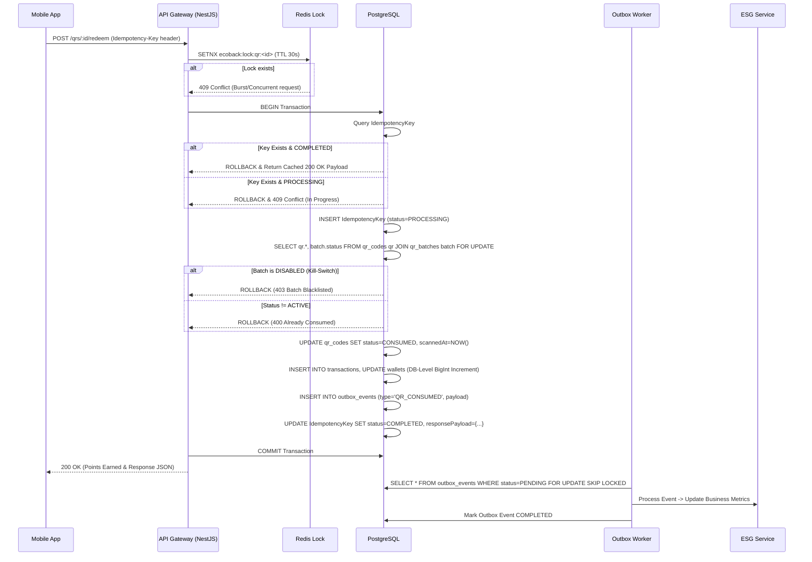

# EcoBack Backend System Design & Technical Specification

## 1. Deep System Design

### 1.1 Module Responsibilities & Boundaries
- **QR Module (`qrs`)**: Generates secure QR batches (`QRBatch`). Validates cryptographic signatures containing a `keyVersion` to support seamless key rotation. Enforces strict batch-level Kill-Switches.
- **Reward Module (`rewards`)**: Double-entry ledger. All wallet balance updates are executed via atomic SQL statements (`UPDATE ... balance = balance + X`) utilizing `BigInt` to prevent overflow race conditions.
- **Fraud Module (`fraud`)**: Multi-layered defense. Layer 1: Redis for short-lived distributed locking (prevent burst concurrency). Layer 2: Behavioral heuristic tracking. Layer 3: DB-level guarantees.
- **Business/ESG Module (`businesses`)**: Processes outbox events (Transactional Outbox) to ensure Zero-Data-Loss ESG telemetry.
- **User Module (`users`)**: Wraps Firebase Admin SDK. Maintains local profiles and role-based access control (RBAC).

### 1.2 Sequence Flow: QR Scan & Redeem (Idempotency, Retries & Batch Constraints)


### 1.3 Staff-Level Resiliency & Avoidance of Pitfalls
- **Distributed Worker Concurrency:** In high-scale deployments, multiple Outbox Workers will poll the DB at once. Implementing `FOR UPDATE SKIP LOCKED` guarantees instances will not pick up the same row, resolving deadlocks and duplicated processing.
- **Dual-Write Problem Eliminated:** By ensuring wallet increments and the event outbox are bundled inside the same transaction boundary, we guarantee that ESG tracking metrics never drift from the financial reality of the wallet ledger.
- **Network Retries Handled Graciously:** Mobile apps dropping connections and resending identical payloads mathematically yield the exact same `responsePayload` cached in the `IdempotencyKey` record.
- **Kill-Switch Readiness:** Adding parent-level batch state verification inherently prevents wide-scale fraud campaigns (e.g. leaked printed sheets) by instantly terminating processing power over stolen batches.

---

## 2. Technical Specification

### 2.1 Database Schema (Advanced Prisma Evolution)

```prisma
enum Role { CONSUMER, B2B, ADMIN }
enum QRStatus { PENDING, ACTIVE, CONSUMED }
enum BatchStatus { ENABLED, DISABLED }
enum TxType { EARN, REDEEM }
enum OutboxStatus { PENDING, PROCESSING, COMPLETED, FAILED, DLQ }

model User {
  id           String    @id @default(dbgenerated("gen_random_uuid()")) @db.Uuid
  firebaseUid  String    @unique
  role         Role      @default(CONSUMER)
  createdAt    DateTime  @default(now())
  wallet       Wallet?
}

model Business {
  id                 String    @id @default(dbgenerated("gen_random_uuid()")) @db.Uuid
  name               String
  taxId              String    @unique
  totalRecycledItems Int       @default(0)
  batches            QRBatch[]
}

model QRBatch {
  id          String      @id @default(dbgenerated("gen_random_uuid()")) @db.Uuid
  businessId  String      @db.Uuid
  business    Business    @relation(fields: [businessId], references: [id])
  status      BatchStatus @default(ENABLED)
  createdAt   DateTime    @default(now())
  
  qrs         QRCode[]
}

model QRCode {
  id          String    @id @default(dbgenerated("gen_random_uuid()")) @db.Uuid
  batchId     String    @db.Uuid
  batch       QRBatch   @relation(fields: [batchId], references: [id])
  signature   String    // HMAC appended
  keyVersion  Int       @default(1) // HMAC key version rotation capability
  status      QRStatus  @default(PENDING) // PENDING, ACTIVE, CONSUMED
  version     Int       @default(1) // Optimistic locking
  consumerId  String?   @db.Uuid
  scannedAt   DateTime?

  @@index([status, batchId])
}

model Wallet {
  id               String    @id @default(dbgenerated("gen_random_uuid()")) @db.Uuid
  userId           String    @unique @db.Uuid
  balanceEcoPoints BigInt    @default(0)
  updatedAt        DateTime  @updatedAt
  version          Int       @default(1)

  // NOTE: Operations mutating balanceEcoPoints MUST use Atomic Increments
  // e.g. prisma.wallet.update({ data: { balanceEcoPoints: { increment: BigInt(X) } } })
}

model Transaction {
  id          String   @id @default(dbgenerated("gen_random_uuid()")) @db.Uuid
  walletId    String   @db.Uuid
  amount      BigInt
  type        TxType
  qrId        String?  @db.Uuid
  createdAt   DateTime @default(now())
}

model IdempotencyKey {
  key             String   @id
  userId          String   @db.Uuid
  endpoint        String
  responsePayload Json?    
  status          String   @default("PROCESSING") // PROCESSING, COMPLETED
  createdAt       DateTime @default(now())

  @@unique([key, userId])
  @@index([createdAt]) // Ideal for scheduled TTL cleanup jobs
}

model OutboxEvent {
  id               String       @id @default(dbgenerated("gen_random_uuid()")) @db.Uuid
  eventType        String
  payload          Json
  status           OutboxStatus @default(PENDING)
  retryCount       Int          @default(0)
  nextAttemptAt    DateTime?
  lastErrorMessage String?
  createdAt        DateTime     @default(now())
}
```

### 2.2 API Contracts
- **Header**: `Idempotency-Key` (UUIDv4 passed from mobile app). Prevents redundant processing from dropped connectivity. 
- **Endpoint Constraints**: Fails instantly if `signature` mismatch occurs against the active `keyVersion`. Checks batch suspension status immediately.

### 2.3 Behavioral Fraud Detection (Human-Scale Protections)
Beyond strict cryptographic checking (`HMAC`), robust systems identify irregular aggregate actions.
1. **Velocity Rate-Limiting**: Track scan velocities tied strictly to the user in Redis (`ecoback:fraud:velocity:<userId>`). If a user scans more than 5 QRs per minute, we decline the transaction out-of-band and drop a silent behavioral flag/alert for Admin review.
2. **Geo-Fenced Alerts**: (Future Capability) Validating if QRs associated with distinct disparate business locations (e.g. 50 miles away) are being scanned within impossible timing intervals (e.g. less than an hour apart), nullifying the transaction.

---

## 4. Operational Resilience Checklist

Before migrating to `main` and provisioning the final architecture pipeline, guarantee the subsequent tenets:

**🟢 Idempotency & Data Stability**
- [ ] Wallet logic strictly relies on DB native operators (`Atomic Increments`) resolving Read-Modify-Write hazards.
- [ ] Wallet and Event quantities are mapped to `BigInt` (or PostgreSQL `DECIMAL(28,0)`) terminating overflow edge cases securely at tens of millions.
- [ ] Active Retention Policy bounds scaling bloat for the logic: schedule a cronjob or DB-level TTL deletion targeting `IdempotencyKey` rows over 48 hours old.

**🟢 Outbox Reliability & Pipeline Safety**
- [ ] Implement Worker Concurrency explicitly via `SELECT ... FOR UPDATE SKIP LOCKED` inside worker polling modules.
- [ ] Implement Exponential Backoff mapping: Failed Outbox jobs calculate `nextAttemptAt = now() ^ (retryCount * 2)`.
- [ ] Architect the Dead Letter Queue (DLQ): Shift events to `DLQ` status if `retryCount` exceeds 5 critical attempts. Trigger PagerDuty/Slack operational alerts upon threshold breach.
- [ ] Historical Archiving Strategy: Migrate `COMPLETED` records to a `historical_outbox_events` mirror-table efficiently after 30 days conserving hot-table search parameters.

**🟢 Operational Security Bounds**
- [ ] Implement `QRBatch` suspension logic seamlessly across the application routing infrastructure guaranteeing immediate termination via kill-switch policies.
- [ ] Double-check `HMAC` signatures integrate tightly on the `id` of the `QRCode`, the assigned `businessId`, alongside a rotation-friendly `keyVersion`, crippling URL sharing and spoofing attempts dynamically.
- [ ] Retain fail-open logic: If Redis is completely unreachable for the `SETNX` lock iteration or Velocity caching, gracefully shift to rely upon PostgreSQL constraints and `SELECT ... FOR UPDATE` isolation scopes.
