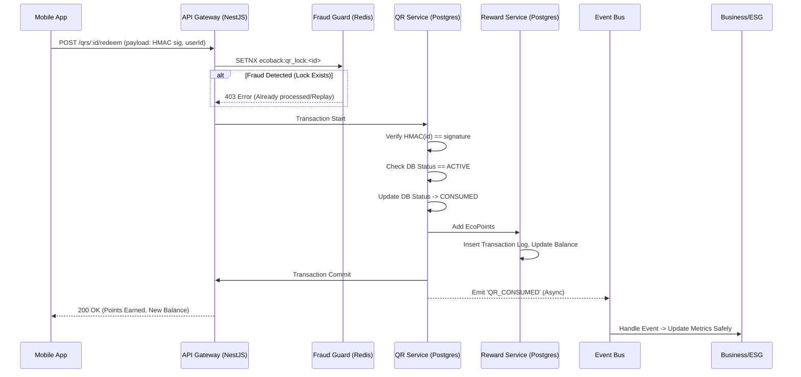

# EcoBack Backend System Design & Technical Specification

## 1. Deep System Design

### 1.1 Module Responsibilities & Boundaries
- **QR Module (`qrs`)**: Generates secure QR batches. Validates signatures via HMAC. Manages QR status transitions (`PENDING` -> `ACTIVE` -> `CONSUMED`). Completely decoupled from Users.
- **Reward Module (`rewards`)**: Double-entry ledger for EcoPoints. Handles all balance mutations. Cannot be mutated directly by external APIs, only responds to authenticated internal event triggers and strictly controlled service methods.
- **Fraud Module (`fraud`)**: Acts as a middleware/guard for critical actions. Interfaces with Redis for idempotency, rate limiting, and replay prevention.
- **Business/ESG Module (`businesses`)**: Processes async events from QR consumption to increment ESG metrics (e.g., `total_recycled_items`).
- **User Module (`users`)**: Wraps Firebase Admin SDK. Maintains local profiles and role-based access control (RBAC).

### 1.2 Sequence Flow: QR Scan & Redeem (Critical Path)


### 1.3 Bottlenecks & Mitigation
- **Bottleneck**: Row-level locking on the `qr_codes` database table during a high volume of concurrent scans.
  **Mitigation**: The Redis `SETNX` lock prevents duplicate processing long before reaching PostgreSQL. This drastically reduces DB locking contention.
- **Bottleneck**: ESG reporting queries locking the `businesses` table.
  **Mitigation**: Using event-driven async updates for ESG metrics, preventing heavy write-locks during the consumer's fast QR scan flow. Real-time dashboard queries should eventually be routed to a Database Read Replica.

---

## 2. Technical Specification

### 2.1 Database Schema (PostgreSQL via Prisma ORM)

```prisma
// This maps to exact SQL schemas but Prisma handles type safety beautifully with NestJS

enum Role {
  CONSUMER
  B2B
  ADMIN
}

enum QRStatus {
  PENDING
  ACTIVE
  CONSUMED
}

enum TxType {
  EARN
  REDEEM
}

model User {
  id           String    @id @default(dbgenerated("gen_random_uuid()")) @db.Uuid
  firebaseUid  String    @unique
  role         Role      @default(CONSUMER)
  createdAt    DateTime  @default(now())
  
  wallet       Wallet?
  scannedQRs   QRCode[]
}

model Business {
  id                 String    @id @default(dbgenerated("gen_random_uuid()")) @db.Uuid
  name               String
  taxId              String    @unique
  totalRecycledItems Int       @default(0)
  qrs                QRCode[]
}

model QRCode {
  id          String    @id @default(dbgenerated("gen_random_uuid()")) @db.Uuid
  batchId     String    
  businessId  String    @db.Uuid
  business    Business  @relation(fields: [businessId], references: [id])
  signature   String    // HMAC(Secret, id)
  status      QRStatus  @default(PENDING)
  consumerId  String?   @db.Uuid
  consumer    User?     @relation(fields: [consumerId], references: [id])
  scannedAt   DateTime?

  transactions Transaction[]

  @@index([status, batchId])
}

model Wallet {
  id               String    @id @default(dbgenerated("gen_random_uuid()")) @db.Uuid
  userId           String    @unique @db.Uuid
  user             User      @relation(fields: [userId], references: [id])
  balanceEcoPoints Int       @default(0)
  updatedAt        DateTime  @updatedAt

  transactions     Transaction[]
}

model Transaction {
  id          String   @id @default(dbgenerated("gen_random_uuid()")) @db.Uuid
  walletId    String   @db.Uuid
  wallet      Wallet   @relation(fields: [walletId], references: [id])
  amount      Int
  type        TxType
  qrId        String?  @db.Uuid
  qr          QRCode?  @relation(fields: [qrId], references: [id])
  createdAt   DateTime @default(now())

  @@index([walletId])
}
```

### 2.2 API Contracts

**1. Redeem QR Endpoint (High Performance, < 200ms)**
- **Route**: `POST /api/v1/qrs/:id/redeem`
- **Request Body**: `{ "signature": "hex_string_of_hmac" }`
- **Headers**: `Authorization: Bearer <Firebase_JWT>`
- **Response (200)**: `{ "status": "success", "earnedPoints": 10, "newBalance": 150 }`
- **Response (400/403/429)**: `{ "error": "Bad Request", "message": "Invalid signature | QR already consumed | Rate limited" }`

**2. Generate Batch (Admin/Business)**
- **Route**: `POST /api/v1/businesses/:id/qrs/batch`
- **Request Body**: `{ "quantity": 1000, "pointsValue": 10 }`
- **Response (201)**: `{ "batchId": "abc-123", "processingStatus": "In Progress (Job queued)" }` (Handled via BullMQ)

### 2.3 Redis Anti-Fraud & Key Strategy
- **Replay Protection (Idempotency)**: Key `ecoback:qr_redeem:<qr_id>` | Val `1` | TTL: `1 year`. We use SETNX to guarantee absolute atomicity before the DB.
- **Rate Limiting (Spoofing/Abuse)**: Key `ecoback:rl:redeem:<user_id>` | Val `counter` | TTL: `60s` (Max 15 scans per minute per user).

### 2.4 Event System (Event-Driven Updates)
- **Engine**: NestJS `EventEmitter2` (in-memory initially -> easy refactor to Kafka/SQS).
- **Core Events**:
  - `qr.redeemed`: Triggered ONLY after a successful DB commit. The `Business` service listens and does a fast `$inc` for ESG reporting metrics without tying up the Consumer API request.
  - `user.created`: Listener in `Reward` service attaches an empty Wallet to the user automatically to avoid wallet checks at scan time.

## 3. Implementation Plan Overview (Folder Structure & Libraries)

### 3.1 Stack Choices
- **Framework**: `NestJS` (Strict IoC, decorators, easy microservices transition).
- **ORM**: `Prisma Client` (Type-safe, fast).
- **Caching/Queues**: `ioredis` + `BullMQ` (Background QR batch generation).
- **Validation**: `class-validator` + `class-transformer`.

### 3.2 Production-Grade Structure
```
src/
 ├─ main.ts
 ├─ app.module.ts
 ├─ config/               # Env validation & loading
 ├─ common/
 │   ├─ guards/           # FirebaseAuthGuard, RateLimitGuard
 │   ├─ interceptors/     # Logging, Response mapping
 │   ├─ filters/          # Global Exception Filter
 │   └─ decoratos/        # @CurrentUser()
 ├─ modules/
 │   ├─ qr/               # QrService, QrController, QrTransactions
 │   ├─ user/
 │   ├─ reward/
 │   ├─ business/
 │   └─ fraud/            # Redis connection & Lock utilities
 └─ providers/            # PrismaModule, FirebaseModule, RedisModule
```
